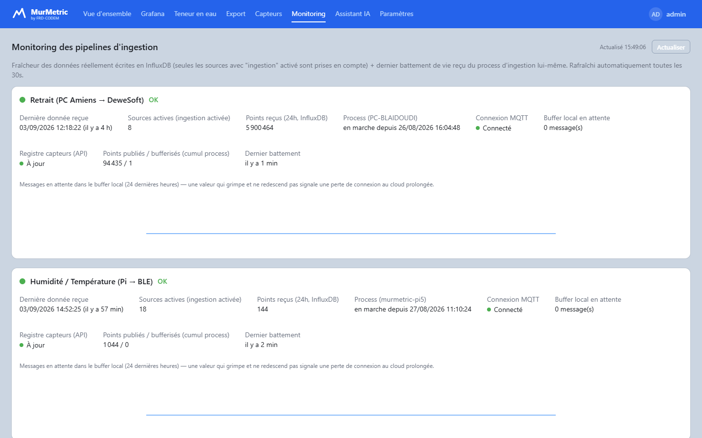
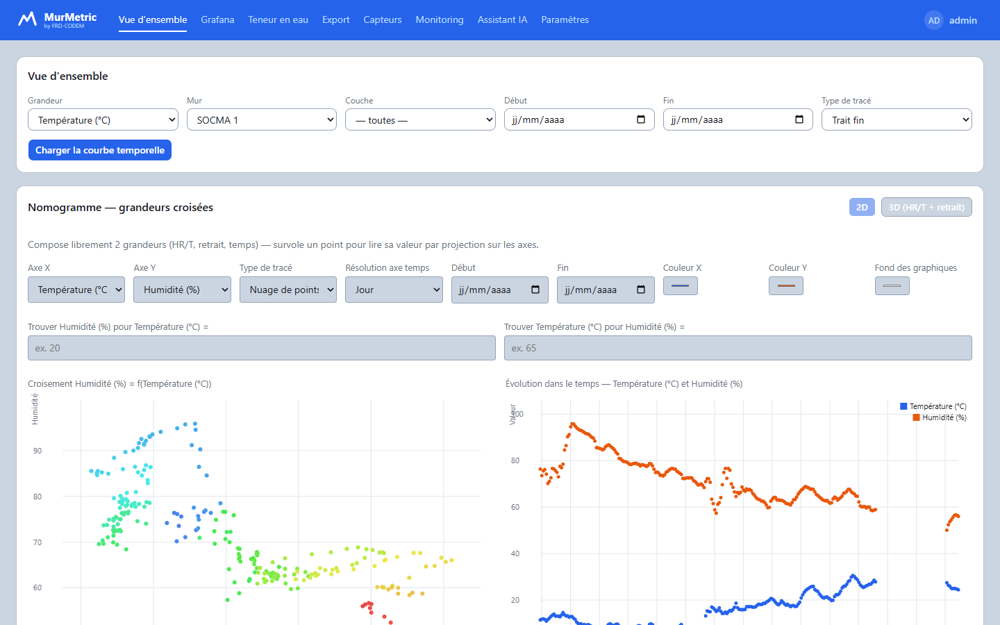
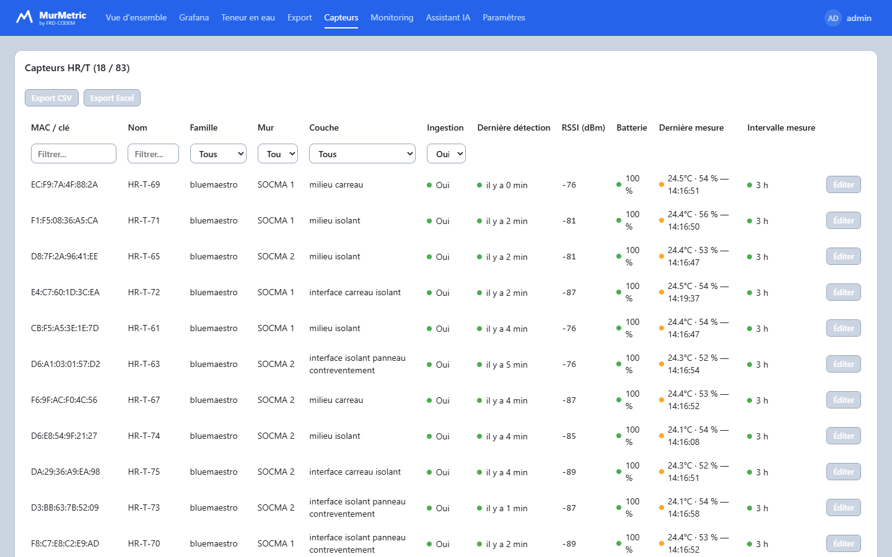
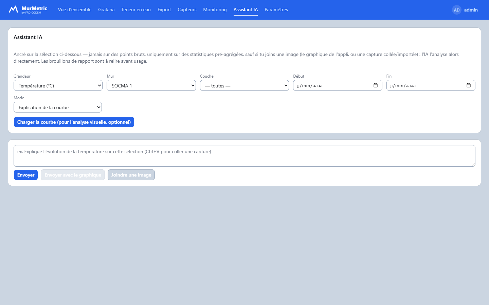
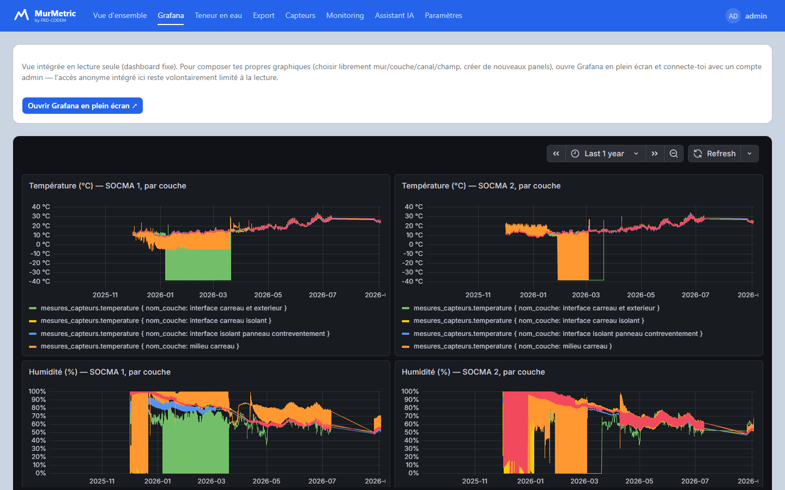

# MurMetric — Plateforme IoT de monitoring métrologique des parois biosourcées

> Pipeline IoT temps réel (BLE + acquisition filaire haute fréquence) et
> webapp d'analyse, pour le suivi hygrothermique de parois biosourcées
> (chanvre-chaux, paille) sur plusieurs chantiers — **FRD-CODEM**

---

## Ce que ce projet démontre

| Domaine | Éléments concrets dans ce repo |
|---|---|
| **Pipeline de données** | MQTT → Kafka → InfluxDB, découplage producteur/consommateur, rétention 7 jours, consumer scalable horizontalement |
| **Bases de données time-series** | Modèle tags/fields InfluxDB, agrégation à 3 paliers selon la plage temporelle, garde-fous anti-surcharge sur les requêtes non agrégées |
| **Ingénierie de résilience** | Buffer SQLite store-and-forward sur 2 sites terrain, republication automatique après coupure réseau |
| **Conteneurisation & orchestration** | Images Docker multi-stage, stack `docker-compose` (6 services), manifests Kubernetes (k3s) pour un mode SaaS multi-tenant |
| **Sécurité applicative** | JWT + bcrypt, anti brute-force par verrouillage temporisé, comparaison en temps constant, CORS restrictif, modèle d'auth à 3 niveaux |
| **Full-stack** | Webapp React/Tailwind/shadcn + API FastAPI, visualisation de données custom (canvas, croisement 2D/3D) |
| **IA appliquée** | Assistant avec *tool-use* (LLM Groq/Gemini), ancré sur des statistiques pré-agrégées plutôt que des données brutes, repli vision pour l'analyse de graphiques |

---

## Sommaire

1. [Contexte et problématique](#1-contexte-et-problématique)
2. [Architecture générale](#2-architecture-générale)
3. [Interface web (webapp)](#3-interface-web-webapp)
4. [Capteurs et contraintes terrain](#4-capteurs-et-contraintes-terrain)
5. [Choix technologiques](#5-choix-technologiques)
6. [Structure du projet](#6-structure-du-projet)
7. [Installation et déploiement](#7-installation-et-déploiement)
8. [Configuration des capteurs](#8-configuration-des-capteurs)
9. [Déploiement Kubernetes (SaaS)](#9-déploiement-kubernetes-saas)
10. [Auteur, organisation et licence](#10-auteur-organisation-et-licence)

---

## 1. Contexte et problématique

Les matériaux biosourcés (chanvre-chaux, paille) ont un excellent profil
thermique et carbone, mais leur comportement hygrothermique dans le temps
reste peu documenté à grande échelle : cinétiques de séchage, évolution de
la teneur en eau, phase de retrait. Ces questions conditionnent la
durabilité et la performance énergétique des bâtiments biosourcés, et ne
peuvent être répondues que par un monitoring continu **in situ**.

> **Problématique** : collecter, transporter et exploiter en continu les
> données métrologiques (température, humidité, retrait) de centaines de
> capteurs coulés dans des parois de chantiers dispersés géographiquement,
> avec robustesse, scalabilité et pérennité.

Contraintes principales : capteurs **physiquement inaccessibles** une fois
coulés (aucune maintenance possible), signal BLE devant traverser la paroi,
connectivité terrain instable, deux débits de données très différents (BLE
24h vs capteurs de retrait à 1 mesure/s), et un besoin de conservation des
données sur plusieurs années.

---

## 2. Architecture générale

```
┌─────────────────────────────────────────────────────────────────────────┐
│  TERRAIN — Site Amiens (exemple)                                        │
│                                                                         │
│  Parois instrumentées                                                   │
│  ┌──────────────┐   BLE advertising                                     │
│  │ Disc Maxi ×N │ ──────────────────► Raspberry Pi 5                   │
│  │ (T°, HR%)    │   passive scan       ingestion/raspberry_pi/          │
│  └──────────────┘   company ID filter                                   │
│                                              │                          │
│  ┌──────────────┐   Export .dxd               │                          │
│  │ Capteur      │ ──────────────────► PC labo Windows                  │
│  │ retrait (×N) │   1 msg/s (dépôt fichier)   ingestion/pc_amiens/       │
│  └──────────────┘                                                       │
│                                              │                          │
│                           SQLite local  ◄────┤ Si VPS inaccessible      │
│                           (buffer local) └── republication auto         │
└───────────────────────────────┬─────────────────────────────────────────┘
                                │ MQTT (TLS, port 8883)
                                ▼
┌─────────────────────────────────────────────────────────────────────────┐
│  CLOUD VPS — pipeline/ (docker-compose ou Kubernetes)                    │
│                                                                         │
│  ┌─────────────┐    ┌──────────────────────┐    ┌──────────────────┐   │
│  │  Mosquitto  │───►│ bridge_mqtt_to_kafka  │───►│     Kafka        │   │
│  │  MQTT broker│    │ (transfère sans       │    │ rétention 7 j    │   │
│  └─────────────┘    │  transformer)         │    │ 3 topics/tenant  │   │
│                     └──────────────────────┘    └────────┬─────────┘   │
│                                                          │              │
│                     ┌──────────────────────┐             │              │
│                     │ kafka_consumer_influx │◄────────────┘              │
│                     │ batch async 500pts/1s │                            │
│                     └──────────┬───────────┘                            │
│                                │                                         │
│                     ┌──────────▼───────────┐    ┌──────────────────┐   │
│                     │      InfluxDB 2.7    │───►│  Grafana / Webapp │   │
│                     │  mesures_capteurs    │    │                   │   │
│                     │  registre_capteurs   │    │                   │   │
│                     │  mesures_dewesoft    │    └──────────────────┘   │
│                     └──────────────────────┘                            │
└─────────────────────────────────────────────────────────────────────────┘
```

### Résilience sur deux segments

| Segment | Mécanisme | Scénario couvert |
|---|---|---|
| Terrain → VPS | SQLite local + republication auto | Coupure réseau, VPS inaccessible |
| Mosquitto → InfluxDB | Kafka (rétention 7 jours) | Crash InfluxDB, redémarrage consumer |

Cette résilience est observable en direct depuis la webapp (page
**Monitoring**) : fraîcheur des données écrites en InfluxDB, état des
connexions MQTT et des buffers locaux.



---

## 3. Interface web (webapp)

React + Tailwind CSS + shadcn/ui, servie par FastAPI — donne un accès
direct aux données sans passer par les outils techniques du pipeline.

<table>
<tr>
<td width="50%">

**Vue d'ensemble** — nomogramme de croisement 2D/3D entre grandeurs
(température, humidité, retrait, temps), survol multi-courbes.


</td>
<td width="50%">

**Gestion des capteurs** — registre éditable (mur, couche, batterie, RSSI),
filtres, export CSV/Excel.


</td>
</tr>
<tr>
<td width="50%">

**Assistant IA** — ancré sur des statistiques pré-agrégées (jamais les
points bruts), analyse visuelle si une image de graphique est jointe.


</td>
<td width="50%">

**Dashboards Grafana intégrés** — vue en lecture seule embarquée, lien vers
l'instance complète pour composer ses propres panneaux.


</td>
</tr>
</table>

D'autres pages : connexion, saisie de teneur en eau, export de données
(CSV/Parquet, direct ou tâche de fond), paramètres de compte.

---

## 4. Capteurs et contraintes terrain

| | Blue Maestro Disc Maxi (BLE) | Capteur de retrait (DeweSoftX) |
|---|---|---|
| Mesure | Température (±0.3°C) + Humidité (±2%) | Retrait filaire, 1 mesure/s/canal |
| Autonomie | Pile CR2477, 4-5 ans (log réglé à 24h) | Alimentation filaire |
| Protocole | BLE 4.2, **publicité passive uniquement** (préserve la batterie, aucun timeout de connexion) | Export `.dxd`, lu via SDK **DWDataReader** (ctypes) |
| Contrainte clé | Coulé dans la paroi — signal doit la traverser, aucune maintenance possible | Débit élevé — absorbé par le mode batch async du consumer Kafka |

Configuration BLE automatique (`setlog~86400`) via
`ingestion/raspberry_pi/configure_capteurs.py`, appliquée dès qu'un capteur
non configuré est détecté.

---

## 5. Choix technologiques

| Techno | Rôle | Pourquoi |
|---|---|---|
| **Python** (asyncio, `bleak`) | Ingestion terrain | Excellent support BLE, gestion concurrente native (scan + sync + reconfig), multiplateforme RPi/Windows |
| **BLE passif** (advertising) | Protocole de collecte | Pas de connexion GATT en continu → batterie préservée, centaines de capteurs monitorables sans timeout |
| **MQTT** (`paho-mqtt`, QoS 1) | Transport terrain → cloud | Léger, résilient aux connexions instables, standard IoT |
| **Apache Kafka** | Découplage + buffer cloud | Absorbe le débit du retrait (1 msg/s), permet d'ajouter un consommateur sans toucher au reste, rétention 7j = résilience au redémarrage InfluxDB, topics namespaced par tenant (SaaS) |
| **InfluxDB 2.7** | Stockage time-series | Modèle tags/fields adapté aux métadonnées capteurs, requêtes Flux |
| **SQLite** | Buffer terrain | Store-and-forward sans dépendance externe, indépendant par machine |
| **Docker / docker-compose** | Conteneurisation VPS | Reproductibilité, isolation, `restart: unless-stopped` |
| **Kubernetes (k3s)** | Orchestration SaaS | Déploiement par client, scaling horizontal du consumer, rolling updates |
| **React + FastAPI** | Webapp | SPA + API type-safe, un seul conteneur (frontend buildé, servi statiquement) |
| **Groq / Gemini (LLM)** | Assistant IA | Tool-use sur données pré-agrégées, repli vision multi-fournisseur |

---

## 6. Structure du projet

```
MurMetric-IoT-Plateform/
├── ingestion/
│   ├── raspberry_pi/     # Ingestion BLE (start.py, ingestion_capteurs_bluetooth.py,
│   │                     #   configure_capteurs.py, capteurs.example.json)
│   └── pc_amiens/        # Ingestion DeweSoftX (start_dewesoft.py,
│                         #   ingestion_dewesoft_dxd.py, SDK DWDataReader)
├── pipeline/             # VPS : bridge MQTT→Kafka, consumer Kafka→InfluxDB, backfills
├── deploy/docker/        # Dockerfiles, docker-compose, mosquitto, provisioning Grafana
├── k8s/                  # Manifests Kubernetes (déploiement SaaS)
├── murmetric_webapp/     # Interface web (frontend React + backend FastAPI)
├── docs/screenshots/     # Captures d'écran (ce README)
└── requirements*.txt     # Dépendances par cible (racine = référence globale)
```

---

## 7. Installation et déploiement

### Prérequis
Python 3.12+, Docker + Docker Compose (VPS), Git.

### Raspberry Pi (terrain — ingestion BLE)
```bash
git clone https://github.com/GuyMartial24/MurMetric-IoT-Plateform.git
cd MurMetric-IoT-Plateform
python -m venv .venv && source .venv/bin/activate
pip install -r ingestion/raspberry_pi/requirements-rpi.txt
export MQTT_BROKER=<ip_vps>
python ingestion/raspberry_pi/start.py
```

### PC labo Windows (terrain — DeweSoftX)
```powershell
git clone https://github.com/GuyMartial24/MurMetric-IoT-Plateform.git
cd MurMetric-IoT-Plateform
python -m venv .venv; .venv\Scripts\activate
pip install -r ingestion/pc_amiens/requirements-windows.txt
$env:MQTT_BROKER = "<ip_vps>"
python ingestion/pc_amiens/start_dewesoft.py
```
Nécessite le SDK DWDataReader — voir
[`ingestion/pc_amiens/DWDataReader_v5_0_8/README.md`](ingestion/pc_amiens/DWDataReader_v5_0_8/README.md).

### VPS Cloud (stack complète)
```bash
git clone https://github.com/GuyMartial24/MurMetric-IoT-Plateform.git
cd MurMetric-IoT-Plateform/deploy/docker
cp ../../.env.example .env   # renseigner les valeurs
./generer_mosquitto_password.sh
export INFLUX_TOKEN=<mon_token_influxdb>
docker compose up -d --build
docker compose ps
```

### Webapp (build manuel, hors docker-compose)
```bash
docker build -t murmetric-webapp -f deploy/docker/Dockerfile.webapp .
```

### Variables d'environnement principales

| Variable | Défaut | Description |
|---|---|---|
| `MQTT_BROKER` | `localhost` | Adresse du broker MQTT cloud |
| `INFLUX_TOKEN` | — | Token API InfluxDB (**obligatoire en production**) |
| `INFLUX_URL` / `INFLUX_ORG` / `INFLUX_BUCKET` | localhost / FRD_CODEM / — | Connexion InfluxDB |
| `KAFKA_BOOTSTRAP` | `localhost:9092` | Serveurs Kafka |
| `TENANT_ID` | `frd` | Namespacing Kafka (multi-tenant SaaS) |
| `JWT_SECRET_KEY` / `ADMIN_BOOTSTRAP_USERNAME/PASSWORD` | — | Authentification webapp |

Liste complète : [`.env.example`](.env.example).

---

## 8. Configuration des capteurs

Registre géré via `capteurs.json` (hot-reload, pas de redémarrage requis) —
voir [`ingestion/raspberry_pi/capteurs.example.json`](ingestion/raspberry_pi/capteurs.example.json)
pour la structure exacte (données factices ; les vraies coordonnées GPS et
codes prestation clients ne sont pas versionnés).

**Workflow** : détection auto d'un nouveau capteur BLE (`ingestion: false`)
→ validation opérateur (renseigner mur/couche, passer `ingestion: true`) →
prise en compte immédiate (hot-reload) → configuration GATT automatique
(`setlog~86400`).

Ce registre est aussi consultable et éditable directement depuis la
webapp (page **Capteurs**), avec filtres et export.


---

## 9. Déploiement Kubernetes (SaaS)

Cible à long terme : une offre SaaS pour d'autres maîtres d'ouvrage/bureaux
d'études, avec isolation par `TENANT_ID` (topics Kafka namespacés
`murmetric.{tenant}.*`).

```bash
curl -sfL https://get.k3s.io | sh -
cp k8s/secrets.yaml.template k8s/secrets.yaml   # éditer, valeurs en base64
kubectl apply -f k8s/namespace.yaml -f k8s/secrets.yaml
kubectl apply -f k8s/mosquitto/ -f k8s/kafka/ -f k8s/influxdb/
kubectl apply -f k8s/bridge-mqtt-kafka/ -f k8s/kafka-consumer-influx/
kubectl get pods -n murmetric
kubectl scale deployment kafka-consumer-influx --replicas=3 -n murmetric
```

---

## 10. Auteur, organisation et licence

**Martial GADJEU** — Data Engineer & IA
✉️ guymg33@gmail.com · 🔗 [GitHub](https://github.com/GuyMartial24)

**FRD-CODEM** — Bureau d'études spécialisé dans la construction durable et
les matériaux biosourcés.

Projet développé pour FRD-CODEM. Code publié à titre de démonstration
technique (portfolio) — les données réelles (clients, coordonnées de
chantiers) et le SDK tiers DWDataReader ont été retirés du repo ; les
fichiers `*.example.json` et les instructions du dossier
`ingestion/pc_amiens/DWDataReader_v5_0_8/` permettent de reproduire un
environnement fonctionnel.


